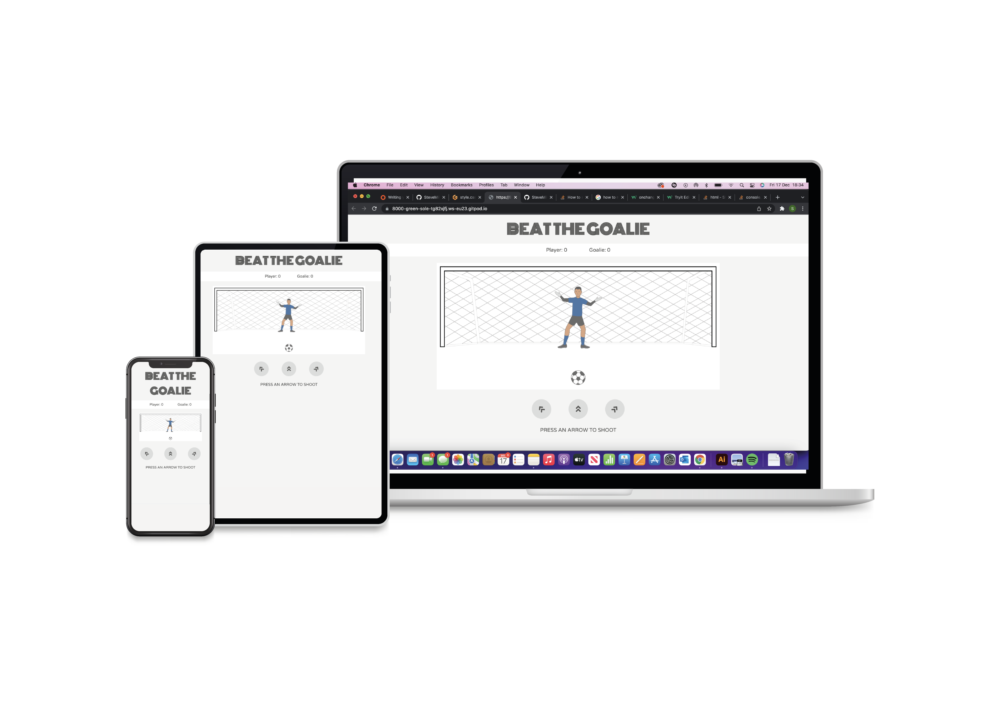

# BEAT THE GOALIE

Beat the Goalie is a simple football based game where the aim is to score against the goal keeper.
Choose left, middle or right direction and hope the keeper doesnt save your shot. Its a game that can be played by all ages and, as its fully responsive, it can be played on a phone, tablet or computer. 
Play it on the sofa, at the park, on the toilet, behind your wifes back or even at your kids nativity play. 

